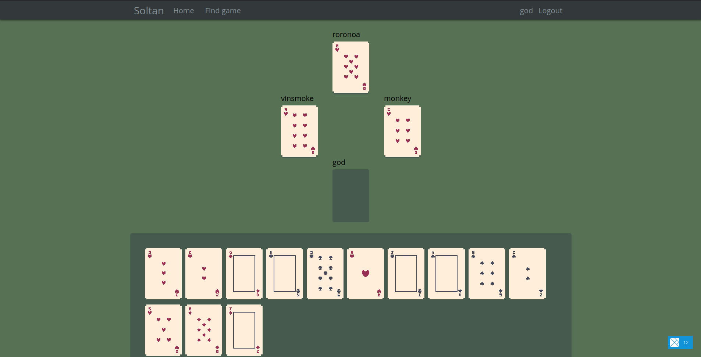

# Soltan

Online hokm game

Frontend: elm, elm-ui
Backend: haskell, servant

## Screenshot



## Build

### Backend

```bash
cd backend
cabal build all
cabal run exe:hokm
```

### Frontend

```bash
cd frontend
elm make src/Main.elm --output=elm.js --optimize
elm reactor # or anything to serve index.html
```
